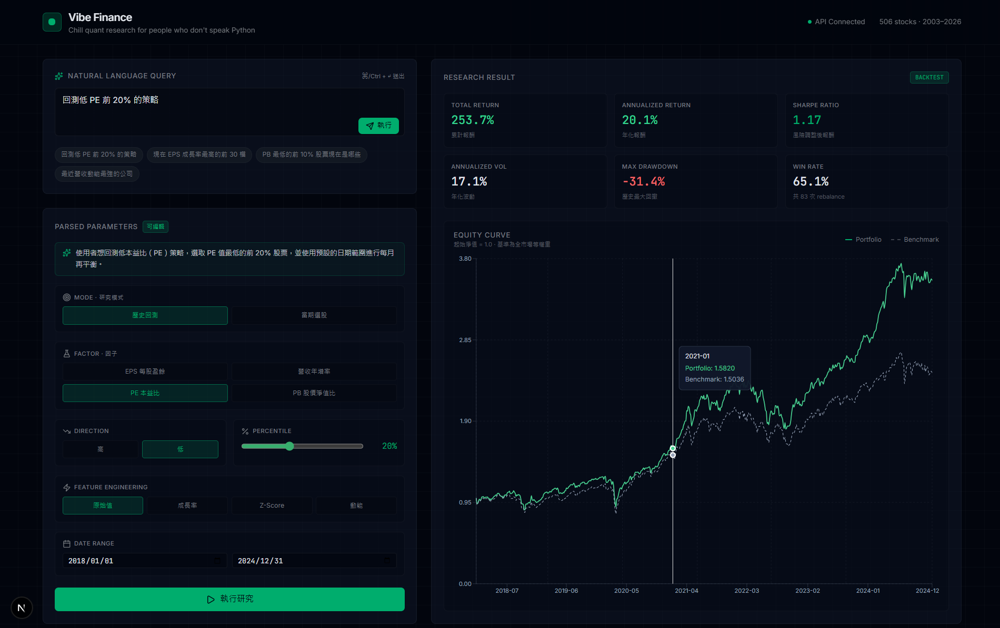
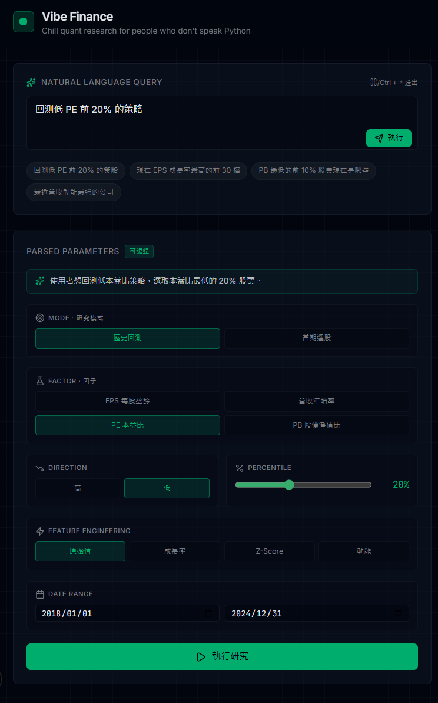

# Vibe Finance

> 不會寫 Python 也能做量化研究。用中文提問，系統自動解析成可編輯的參數面板，確認後才執行回測或選股。

    

## 截圖

- ### 主要介面


- ### 用戶自然語言輸入被解析成可編輯的參數卡片


## 為什麼做這個

大多數「AI 理財助理」都是黑盒子：你問、它答，但你完全不知道它怎麼解讀你的問題。**Vibe Finance** 採取不同做法——每一筆自然語言查詢都會先解析成一個**可編輯的結構化參數面板**，讓你確認、調整後才執行。LLM 是解析器，不是神諭。

這是一個端到端的展示專案，涵蓋資料工程（506 檔台股 × 23 年）、因子計算、特徵工程、自然語言解析、回測引擎，以及 Bloomberg 風格的深色 UI。

## 功能

- **直接用中文問** — `回測低 PE 前 20% 的策略` 或 `現在 EPS 成長率最高的前 30 檔` 直接輸入即可
- **透明參數面板** — 解析結果以可編輯卡片呈現，執行前可手動調整任何欄位
- **兩種模式**
  - **回測** — 累計報酬、年化報酬、Sharpe、最大回撤、勝率、淨值曲線 vs 等權重市場基準
  - **選股** — 依因子排名列出當期標的，含中文股名
- **四大因子** — EPS、營收年增率、本益比（PE）、股價淨值比（PB）
- **四種特徵轉換** — 原始值、成長率、滾動 Z-Score、動能
- **無未來資訊洩漏** — t 期投組由 t 期因子值決定，持有至 t+1 期

## 技術架構

| 層級 | 使用技術 |
|---|---|
| 前端 | Next.js 14 App Router、TypeScript、Tailwind、shadcn/ui、Recharts |
| 後端 | FastAPI、Pydantic v2、pandas、numpy |
| 資料庫 | DuckDB（單檔、高速分析查詢） |
| 自然語言解析 | Gemini 2.5 Flash 結構化輸出 |
| 測試 | pytest |

## 系統流程

```
使用者輸入中文查詢
       │
       ▼
  Gemini 2.5 Flash ──▶ ParsedParams（前端可編輯）
                              │
                              ▼
                     ┌────────────────────┐
                     │    因子引擎        │
                     │    特徵工程        │
                     │       ↓            │
                     │  橫截面排名選股    │
                     │       ↓            │
                     │  回測 / 當期選股   │
                     └────────┬───────────┘
                              │
                              ▼
                    績效指標 + 淨值曲線 / 選股清單
```

## 專案結構

```
vibe-finance/
├── backend/
│   ├── app/
│   │   ├── main.py              FastAPI 入口
│   │   ├── db.py                DuckDB 連線與 schema
│   │   ├── schemas.py           Pydantic 資料合約
│   │   ├── features.py          特徵工程
│   │   ├── factor_engine.py     排名、回測、選股
│   │   ├── gemini.py            自然語言 → 結構化參數
│   │   └── routers/
│   ├── scripts/                 seed_data、smoke_test
│   ├── tests/                   pytest
│   └── data/                    （已加入 .gitignore）
└── frontend/
    ├── app/                     page.tsx、layout、globals.css
    ├── components/              QueryInput、ParamsPanel、BacktestView、ScreenView
    └── lib/                     types、api client
```

## 安裝與啟動

**前置需求：** Python 3.11+、Node 18+、[Google AI Studio](https://aistudio.google.com/apikey) 的 Gemini API 金鑰

```
git clone https://github.com/<your-username>/vibe-finance.git
cd vibe-finance
```

### 後端

```
cd backend
python -m venv venv
source venv/bin/activate        # Windows：venv\Scripts\activate
pip install -r requirements.txt
cp .env.example .env            # 填入你的 GEMINI_API_KEY
# 將 CSV 放入 data/（格式見 data/README.md）
python -m scripts.seed_data     # 建立 market.duckdb
uvicorn app.main:app --reload --port 8000
```

### 前端

```
cd frontend
npm install
npm run dev
```

開啟 http://localhost:3000

## 查詢範例

直接在 UI 輸入中文：

- `回測低 PE 前 20% 的策略` → 回測本益比後段 20%
- `現在 EPS 成長率最高的前 30 檔` → 選出當期 EPS 年增率前 30 名
- `從 2020 年開始，高 EPS 的策略年化報酬多少` → 指定起始日的 EPS 回測
- `PB 最低的前 10% 股票現在是哪些` → 當期最低 PB 選股

## 設計決策

**選 DuckDB 不選 Postgres** — 單一檔案、免安裝，對 200 萬筆以上的資料做分析性 pivot 查詢速度極快，非常適合研究用途。

**Gemini 結構化輸出** — 使用 `response_schema` 讓回應直接對應 Pydantic 型別，不需要繁瑣的 prompt 工程，各種中文表達方式都能穩定解析。

**前端可編輯參數** — 自然語言本來就有歧義，使用者需要在執行前確認系統的解讀。這是相對於黑盒 AI 工具的核心差異。

**等權重基準** — 投組採等權重，若與市值加權指數相比，會把因子 alpha 與規模效應混在一起。等權重市場基準可以更乾淨地歸因。

## 刻意不在範疇內的功能

交易成本、滑價、存活者偏差、產業中性化、因子合成、前進式最佳化。這是一個聚焦在**透明度與使用者體驗**的展示專案，不是生產級的量化平台。

## 範例結果

506 檔台股、2018–2024、月頻換倉：

| 策略 | 年化報酬 | Sharpe | 最大回撤 |
|---|---|---|---|
| 低 PE 後段 20% | ~20.1% | ~1.17 | -31.4% |

僅供參考，非投資建議。

## 待辦

- [ ] 多因子合成評分
- [ ] 滾動 IC / IR 分析
- [ ] 交易成本模擬
- [ ] 產業中性加權
- [ ] 命名策略儲存與比較
- [ ] Parquet / CSV 匯出

## 授權

MIT

## 備註

這是一個探索「可驗證 AI」應用於金融研究的週末 side project——LLM 負責解析意圖，人負責驗證，引擎負責計算。
